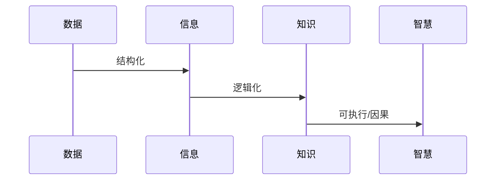

DIKW = Data, Information, Knowledge, Wisdom

通过几张图释来理解数据、信息、知识和智慧之间的区别和相互关系。

## 图释1

*(图片来源：网络/未知)*

上图我们可以理解为：
> 信息是结构化的数据，知识是逻辑化的信息，智慧是可执行的知识。^[[饭否@刘志达](http://fanfou.com/statuses/fbX49zfe-04)]

信息是结构化的数据，赋予了可辨别的含义。  
知识是逻辑化的信息，有了因果关系。  
智慧是可执行的知识，指导如何行动。   ^2b448d

- 用序列图展示关系

## 图示2

信息，是知道是什么，
知识，是知道如何做，
智慧，是知道为什么。

> #数据挖掘 / 如果说数据是新时代的石油，那么学习算法就是从中提取信息的炼油厂；信息积累成知识；知识深化成理解；理解演变为智慧。^[[饭否@知了不可说](https://fanfou.com/statuses/4DYzODYZbbI)]

## 图释3/也是总结
 
数据，是一堆无意义的记录。
信息，是赋予了含义，可辨别的数据。
知识，是形成了连接的信息——信息之网。
洞见，发现知识（信息之网）中的关键信息节点，是对知识的深化理解。
智慧，是关键节点之间的路径。是基于知识知道如何行动的能力。

---

#DIKW #Data #Information #Knowledage #Insight #Wisdom 
#数据 #信息 #知识 #洞见 #智慧 