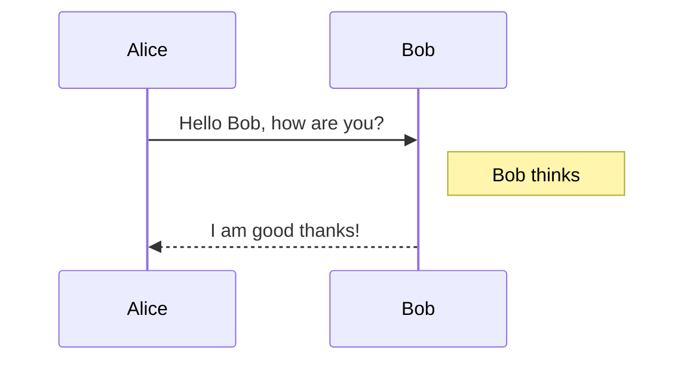
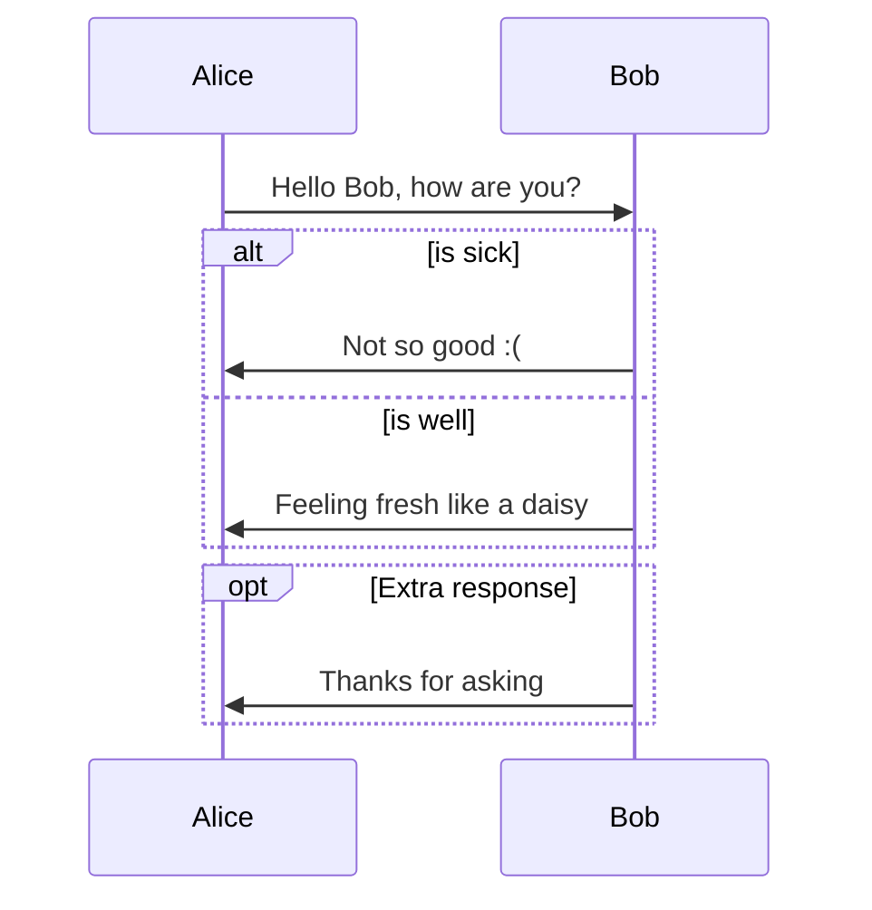

## 序列图 Sequence Diagrams

案例1:

```mermaid
sequenceDiagram
Alice->>Bob: Hello Bob, how are you?
Note right of Bob: Bob thinks
Bob-->>Alice: I am good thanks!
```

案例2:

```mermaid
sequenceDiagram
Alice->>Bob: Hello Bob, how are you?
alt is sick
Bob->>Alice: Not so good :(
else is well
Bob->>Alice: Feeling fresh like a daisy
end
opt Extra response
Bob->>Alice: Thanks for asking
end
```

