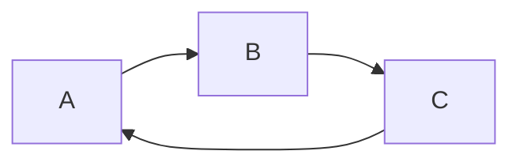
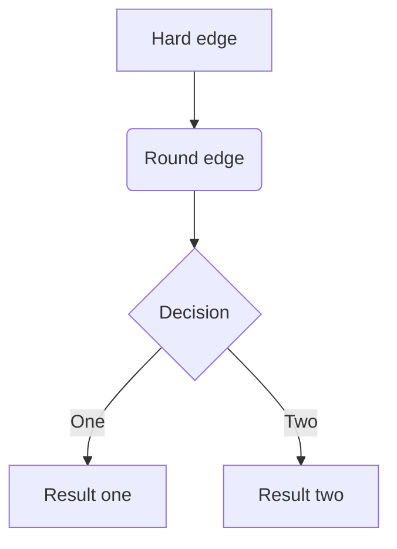

## 流程图 Flow charts

- 案例1:

- 案例2:

## 流程图方向
`LR` Left to Right 从左到右
`RL` Right to Left
`TB` Top to Bottom 从上到下
`BT` Bottom to Top 

## 节点
流程图的节点可以使用[形状](如何做/Obsidian软件手册/图表｜节点形状.md)。

## 线条/连接

- 实线箭头

- 实线

- 带文字标注的实线

- 虚线箭头

- 虚线

- 带文字标注的虚线

- 加粗的实线
