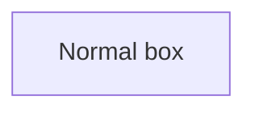
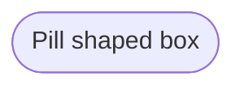
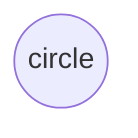
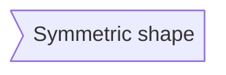
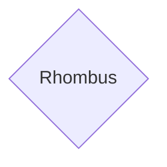
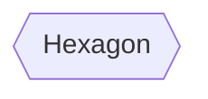
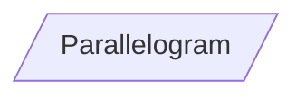
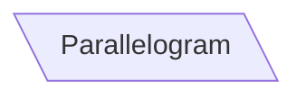
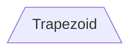
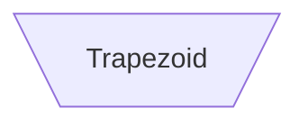

## 节点形状 Node Shapes

- 矩形

```mermaid
graph
boxa[Normal box]
```

- 圆角矩形

```mermaid
graph
boxa(Box with rounded edges)
```

- 药丸矩形

```mermaid
graph
boxa([Pill shaped box])
```

- 圆形

```mermaid
graph
boxa((circle))
```

- 旗形

```mermaid
graph LR
boxa>Symmetric shape]
```

- 菱形

```mermaid
graph
boxa{Rhombus}
```

- 六边形

```mermaid
graph
boxa{{Hexagon}}
```

- 平行四边形

```mermaid
graph
boxa[/Parallelogram/]
```

```mermaid
graph
boxa[\Parallelogram\]
```

- 梯形

```mermaid
graph
boxa[/Trapezoid\]
```

```mermaid
graph
boxa[\Trapezoid/]
```

